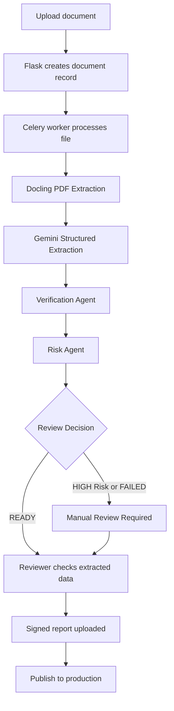
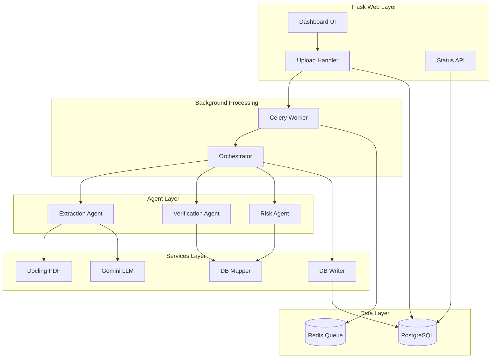
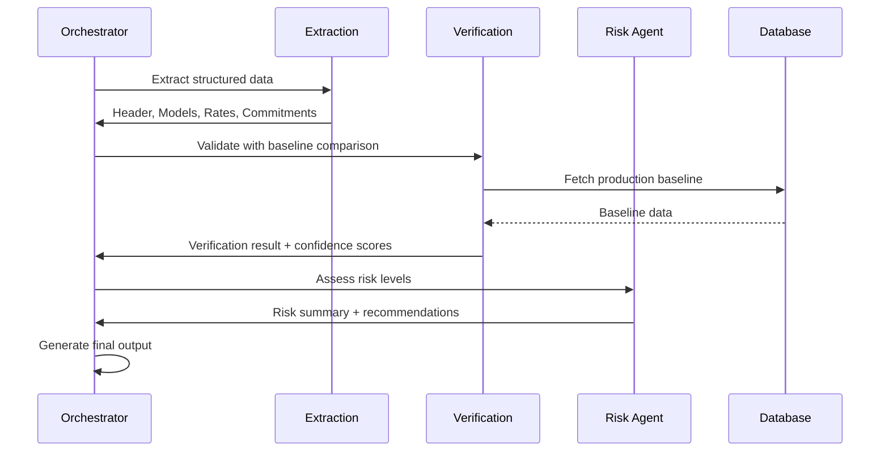
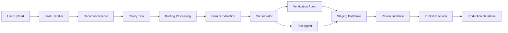

# EDCH Roaming Advisor

<p align="center">
      
</p>

EDCH Roaming Advisor is a Flask-based document processing platform for roaming agreement review. It ingests contract-style files, runs asynchronous extraction and validation in the background, and supports a human review flow before records are published.

The application is built around a practical operator workflow:

1. A user uploads a PDF, DOCX, XLSX, or XLS file.
2. Flask stores the file and creates a document record.
3. Celery processes the document in the background.
4. The extraction pipeline pulls structured agreement data from the file.
5. Verification and risk checks help reviewers assess the result.
6. Signed output can be uploaded and published to production.

<p align="center">
      <b>Upload → background extraction → verification → final review → publish</b>
</p>

---

## Highlights

- Asynchronous document processing with Celery and Redis.
- Flask web UI for upload, dashboard, review, and publishing flows.
- AI-assisted extraction built around Google Gemini and LangChain components.
- Local LM Studio integration for OpenAI-compatible model calls during extraction.
- Structured agreement models for headers, rate tables, and commitments.
- Human review steps for extracted output, signed reports, and final approval.
- Dynamic review templates that scale as agreement header fields expand.
- PostgreSQL persistence with Flask-Migrate support.
- Dockerized local development and deployment.

## Quick Start

### Prerequisites

- Docker Desktop installed and running
- NVIDIA GPU with CUDA support (for Docling GPU acceleration)
- A Google Gemini API key
- A populated `.env` file with the runtime settings below

## Environment Variables Setup

To run this project locally, create a `.env` file in the root directory and populate it with the following variables.

### 1. Core Application Settings

* **`SECRET_KEY`**
  This is used to cryptographically sign Flask session cookies. You can generate a secure random string using Python in your terminal:
  ```bash
  python -c "import secrets; print(secrets.token_hex(32))"
  ```
  Copy the output and set it as your `SECRET_KEY`.

* **`UPLOAD_FOLDER`**
  The local directory path where uploaded documents (PDFs, DOCXs) are stored before processing. Use a relative path pointing to your static folder:
  ```text
  UPLOAD_FOLDER=app/static/pdfs
  ```

### 2. Database & Message Broker

* **`DATABASE_URL`**
  The connection string for your PostgreSQL database. The standard format is:
  ```text
  DATABASE_URL=postgresql://[user]:[password]@[host]:[port]/[database_name]
  ```
  *(Note: If you are running the application via Docker Compose, this will typically default to `postgresql://postgres:postgres@db:5432/postgres`)*

* **`REDIS_URL`**
  The connection string for your Redis instance, which acts as the message broker for background Celery tasks. The standard local format is:
  ```text
  REDIS_URL=redis://localhost:6379/0
  ```
  *(Note: If using Docker Compose, point to the container name: `redis://redis:6379/0`)*

### 3. Third-Party APIs

* **`GEMINI_API_KEY`**
  Required for the LLM document extraction pipeline.
  1. Navigate to [Google AI Studio](https://aistudio.google.com/).
  2. Click on **Get API key** in the left sidebar.
  3. Click **Create API key** and copy the generated string.

* **`SUPABASE_URL`** & **`SUPABASE_ANON_KEY`**
  Required for handling user authentication and session management.
  1. Log into the [Supabase Dashboard](https://supabase.com/dashboard) and select your project.
  2. Click on **Project Settings** (the gear icon ⚙️ in the bottom left sidebar).
  3. Click on **API** in the configuration menu.
  4. Copy the **Project URL** value for your `SUPABASE_URL`.
  5. Copy the **anon / public** key value for your `SUPABASE_ANON_KEY`.
## 2. Start the stack

```bash
docker compose up --build
```

Open the app at `http://localhost:8000`.

If you want to use the local model integration, start LM Studio on the host machine and make sure its OpenAI-compatible server is available at `http://localhost:1234`.

## 3. Apply database migrations

```bash
docker compose exec web flask db upgrade
```

## Local Development

```bash
python -m venv .venv
.venv\Scripts\activate
pip install -r requirements.txt
flask --app wsgi run --port 8000
```

Run the worker in a second terminal:

```bash
celery -A celery_worker.celery worker --loglevel=info
```

## How It Works



## Multi-Agent Architecture

The system uses a sophisticated multi-agent orchestration framework built on LangGraph to coordinate document processing through specialized agents:

### System Architecture



### Orchestrator

The Orchestrator is the central coordination layer built using LangGraph's StateGraph pattern. It manages the entire extraction pipeline and coordinates between specialized agents.

**Key Features:**
- **LangGraph Execution Graph**: Implements a state machine pattern for agent coordination
- **Schema Adaptation**: Transforms friend's relational staging tables into generic JSON tables for agent compatibility
- **Header Deduplication**: Intelligently merges duplicate AGMT_ID entries, preferring non-null values
- **Caching**: In-memory file hash-based caching to avoid redundant extractions
- **Context Selection**: Extracts relevant document sections based on target fields for efficient processing

**Data Flow:**
1. Receives `OrchestratorInput` with file path, partner name, and raw document text
2. Fetches baseline data via `db_mapper` for comparison
3. Runs extraction through Docling + Gemini pipeline
4. Adapts extraction schema to agent-compatible format
5. Coordinates VerificationAgent and RiskAgent execution
6. Returns comprehensive `OrchestratorOutput` with verification results, risk assessment, and comparison tables

### Verification Agent

The VerificationAgent validates extracted tariff data and calculates text grounding confidence scores using multiple validation strategies.

**Text Grounding Algorithms:**

- **Numeric Grounding**: Extracts numbers from the document and matches them against extracted values with floating-point precision
- **Date Grounding**: Parses dates using multiple format patterns (ISO, European, US, text-based) and validates against document content
- **Text Grounding**: Uses sequence matching to find text similarity between extracted values and document chunks

**Confidence Scoring:**
- Per-field confidence scores (0.0 to 1.0 scale)
- System metadata fields automatically receive 1.0 confidence
- Field status classification: `CONFIDENT`, `FLAGGED`, `LOW`
- Special handling for numeric, date, and text field types

**Validation Checks:**
- Currency format validation (supports €, $, £ symbols with numeric patterns)
- Date format validation with multiple format support
- Date consistency checks (start date before end date, logical periods)
- Data type validation for numeric and date fields

**Field Categories:**
- **System Metadata**: AGMT_ID, BULK_ID, CREATED_DATE, etc. (auto-verified)
- **Numeric Fields**: AMOUNT, COMMIT_VALUE, RATE, PRICE, etc. (numeric grounding)
- **Date Fields**: START_DATE, END_DATE, AGMT_EFF_DATE, etc. (date grounding)
- **Text Fields**: All other fields (text grounding with similarity matching)

### Risk Agent

The RiskAgent assesses risk levels for tariff changes by comparing extracted data against baseline production data and applying configurable risk thresholds.

**Risk Assessment Logic:**

1. **Variance Analysis**: Calculates percentage changes between extracted and baseline rates
2. **Confidence Integration**: Considers per-field confidence scores from verification
3. **Financial Field Weighting**: Applies 1.5x multiplier to financial fields (amount, commitment, revenue, cost)
4. **Threshold-Based Classification**: Uses configurable thresholds for risk level determination

**Risk Levels:**
- **HIGH**: Variance > 20% (configurable via `high_variance_threshold`)
- **MEDIUM**: Variance > 5% OR confidence below threshold OR missing fields
- **LOW**: All other cases

**Configurable Parameters:**
- `high_variance_threshold`: 20.0% (default)
- `moderate_variance_threshold`: 5.0% (default)
- `low_confidence_threshold`: 0.65 (default)
- `financial_field_weight`: 1.5 (default)

**Recommendation Generation:**
- "Manager approval required" - confidence < 70% OR HIGH risk present
- "Review recommended before approval" - confidence < 90% OR any flagged rows
- "Safe to proceed" - high confidence with no significant risks

**Special Handling:**
- **MISSING rows**: Treated as validation flags rather than rate changes (0% delta, MEDIUM risk)
- **NEW rows**: Variance calculated against 0 baseline
- **Financial fields**: Higher confidence requirements due to business impact

### Agent Coordination

The agents communicate through structured Pydantic models and share state via the Orchestrator:



**Error Handling:**
- Graceful degradation when baseline data is unavailable
- Partial processing continuation on individual agent failures
- Detailed error reporting with field-level issue tracking
- State persistence for recovery and debugging

### Data Flow Diagram



## Tech Stack

| Layer | Tools |
|---|---|
| Web | Flask, Jinja2 |
| Background jobs | Celery |
| Queue and cache | Redis |
| Database | PostgreSQL |
| AI / orchestration | Google Gemini, LangGraph, Pydantic |
| Document processing | Docling (GPU-accelerated PDF extraction) |
| Data validation | Pydantic |
| File handling | PyMuPDF, python-docx, openpyxl, pandas |
| Deployment | Docker, Docker Compose, Gunicorn, CUDA support |

## Project Structure

```text
app/
├── agents/                # Multi-agent orchestration system
│   ├── orchestrator.py    # LangGraph-based agent coordination
│   ├── verification_agent.py  # Data validation and confidence scoring
│   ├── risk_agent.py      # Risk assessment and recommendation
│   └── extractor/         # Document extraction pipeline
│       ├── docling_extractor.py  # GPU-accelerated PDF processing
│       └── extractor_template.py  # Pydantic extraction schemas
├── blueprints/            # Flask route handlers
│   ├── auth.py            # Authentication routes
│   ├── dashboard.py       # Dashboard and MNO management
│   ├── jobs.py            # Celery task definitions
│   └── update.py          # Document upload and processing
├── models/                # SQLAlchemy ORM models
│   ├── agreement.py       # Staging tables (AGMT_HEADER_STG, etc.)
│   ├── agreement_prod.py  # Production tables
│   ├── agreement_archive.py  # Archive tables
│   ├── document.py        # Document tracking and metadata
│   ├── mno.py            # Mobile Network Operator registry
│   ├── user.py           # User authentication
│   └── audit_log.py      # Change tracking
├── schemas/               # Pydantic validation schemas
│   └── extraction.py     # Extraction result models
├── services/              # Business logic and integrations
│   ├── llm_client.py      # Gemini API client with JSON handling
│   ├── db_mapper.py      # Production baseline data fetching
│   ├── db_writer.py      # Staging data persistence
│   ├── dashboard_service.py  # MNO management operations
│   ├── prompts.py        # LLM prompt templates
│   └── extractors.py     # Legacy extraction utilities
├── static/                # Static assets
│   ├── pdfs/            # Uploaded documents for preview
│   ├── images/          # UI images
│   └── css/             # Stylesheets
├── templates/             # Jinja2 templates
│   ├── dashboard.html   # Main dashboard
│   ├── update.html      # Upload interface
│   ├── processing.html  # Processing status
│   ├── extracted.html   # Data review
│   └── preview_submission.html  # Final review
├── config.py             # Flask configuration
├── extensions.py         # Flask extensions (DB, Celery, etc.)
└── utils.py              # Utility functions
migrations/               # Alembic database migrations
uploads/                   # Temporary upload directory
celery_worker.py          # Celery worker initialization
wsgi.py                   # WSGI application entry point
```

## Document Lifecycle

The main document states used by the app are `PENDING`, `PROCESSING`, `READY`, `REVIEW`, `FAILED`, and `PUBLISHED`.

**State Transitions:**
- `PENDING` → `PROCESSING`: Document uploaded, Celery task started
- `PROCESSING` → `READY`: Extraction and verification successful, risk assessment passed
- `PROCESSING` → `REVIEW`: Verification failed or HIGH risk detected
- `PROCESSING` → `FAILED`: Critical error during processing
- `REVIEW` → `READY`: Manual review completed and approved
- `READY` → `PUBLISHED`: Signed report uploaded and published to production

**Multi-Agent Pipeline Steps:**
1. **Extraction** (Step 2): Docling processes PDF, Gemini extracts structured data
2. **Verification** (Step 3): Validates extracted data, calculates confidence scores
3. **Risk Assessment** (Step 4): Compares against baseline, assesses risk levels
4. **Final Decision** (Step 5): Routes to READY or REVIEW based on confidence and risk

## Recent Improvements

### Multi-Agent Orchestration System
- Implemented LangGraph-based agent coordination for complex document processing
- Added intelligent schema adaptation to maintain compatibility between different data formats
- Introduced file hash-based caching to avoid redundant extractions
- Enhanced error handling with graceful degradation and detailed reporting

### Verification and Risk Assessment
- **VerificationAgent**: Advanced text grounding with numeric, date, and text field validation
- **RiskAgent**: Configurable risk thresholds with financial field weighting
- Confidence scoring system (0-1 scale) with field-level status classification
- Automatic recommendation generation based on confidence and risk levels

### API Migration
- Migrated from OpenRouter to Google Gemini API for improved reliability and performance
- Updated LLM client with robust JSON parsing and retry logic
- Enhanced prompt engineering for telecom-specific extraction tasks

### Database Enhancements
- Added `db_mapper.py` for intelligent baseline data fetching from production tables
- Implemented `db_writer.py` for structured staging data persistence
- Enhanced AGMT_ID handling with deduplication and intelligent merging
- Added comprehensive staging/production/archive table structure

### Dynamic Review System
- Implemented dynamic header field rendering for scalable review templates
- Added baseline comparison with variance calculation and status flags
- Enhanced review tables with MATCH, VARIANCE, NEW, and MISSING status indicators
- Improved conflict detection and resolution tracking

### Performance Improvements
- GPU-accelerated Docling processing for faster PDF extraction
- Optimized database queries with proper indexing and relationship management
- Enhanced Celery task configuration with improved error recovery
- Added concurrent processing capabilities for multi-document workflows

## Extraction And Mapping

The extraction pipeline combines Docling's GPU-accelerated PDF processing with Google Gemini's structured extraction capabilities:

**Components:**
- **Docling Extractor** (`app/agents/extractor/docling_extractor.py`): Processes PDFs with CUDA acceleration, extracts text and table structures
- **LLM Client** (`app/services/llm_client.py`): Gemini API integration with JSON response handling and retry logic
- **DB Mapper** (`app/services/db_mapper.py`): Fetches production baseline data for comparison and variance analysis
- **DB Writer** (`app/services/db_writer.py`): Persists extracted data to staging tables with proper type conversion

**Data Flow:**
1. Document uploaded and saved to `app/static/pdfs/`
2. Docling processes PDF with GPU acceleration (configurable via `MOCK_DOCLING` for testing)
3. Gemini extracts structured data into Pydantic models (header, models, rates, commitments)
4. Orchestrator adapts schema for agent compatibility
5. Verification validates extracted data against source document
6. Risk assessment compares against production baseline
7. Results stored in staging tables with AGMT_ID linking

**Dynamic Review System:**
The review pages render agreement headers dynamically so the UI can accommodate additional header fields without hard-coded form updates. The system supports:
- Automatic field detection and rendering
- Confidence score display per field
- Status flags (CONFIDENT, FLAGGED, LOW)
- Variance highlighting against baseline data

## Key Features

### Confidence-Based Validation
- **Per-field confidence scores** (0.0 to 1.0) based on text grounding analysis
- **Automatic status classification**: CONFIDENT (>0.8), FLAGGED (0.5-0.8), LOW (<0.5)
- **Type-specific validation**: Different grounding strategies for numeric, date, and text fields
- **System metadata handling**: Automatic verification for database-generated fields

### Risk Assessment
- **Intelligent variance analysis**: Compares extracted rates against production baseline
- **Configurable risk thresholds**: Customize sensitivity for different business contexts
- **Financial field awareness**: Higher scrutiny for amount, commitment, and revenue fields
- **Automated recommendations**: Action suggestions based on confidence and risk levels

### Baseline Comparison
- **Production data integration**: Fetches current tariffs from production database
- **Variance calculation**: Computes percentage changes between extracted and baseline
- **Status categorization**: MATCH, VARIANCE, NEW, or MISSING status for each field
- **Visual highlighting**: Color-coded indicators for quick risk assessment

### Multi-Agent Pipeline
- **Orchestrated processing**: LangGraph coordinates specialized agents for each processing stage
- **Error recovery**: Graceful handling of individual agent failures without stopping the pipeline
- **State management**: Comprehensive tracking of processing progress and intermediate results
- **Caching optimization**: Avoids redundant processing through intelligent file hash caching

## Testing

```bash
pytest
```

The repository includes unit, integration, end-to-end, and slow test markers in `pytest.ini`.

## Configuration Reference

| Variable | Purpose |
|---|---|
| `SECRET_KEY` | Flask session secret |
| `DATABASE_URL` | PostgreSQL connection string |
| `REDIS_URL` | Redis broker and result backend |
| `GEMINI_API_KEY` | Google Gemini API key for document extraction |
| `SUPABASE_URL` | Supabase project URL used by the dashboard |
| `SUPABASE_ANON_KEY` | Supabase anonymous key used by the dashboard |
| `UPLOAD_FOLDER` | Local upload destination |

**Risk Assessment Configuration** (can be customized in `app/agents/risk_agent.py`):
- `high_variance_threshold`: 20.0% - Triggers HIGH risk level
- `moderate_variance_threshold`: 5.0% - Triggers MEDIUM risk level
- `low_confidence_threshold`: 0.65 - Minimum confidence for automatic approval
- `financial_field_weight`: 1.5 - Multiplier for financial field confidence requirements

## Notes

- Supported uploads are PDF, DOCX, XLSX, and XLS.
- Files are stored under `app/static/pdfs/` for browser-based preview and review.
- The app uses Flask-Migrate, so schema changes should be managed through migrations rather than direct table edits.
- **GPU Requirements**: Docling PDF processing requires NVIDIA GPU with CUDA support for optimal performance. Set `MOCK_DOCLING=True` in `docling_extractor.py` for CPU-only testing.
- **API Key Security**: Ensure `GEMINI_API_KEY` is kept secure and never committed to version control.
- **Database Migrations**: Run `flask db upgrade` after pulling changes that include schema modifications.
- **Staging vs Production**: The system uses staging tables (`AGMT_HEADER_STG`, etc.) for extracted data before publishing to production tables.
