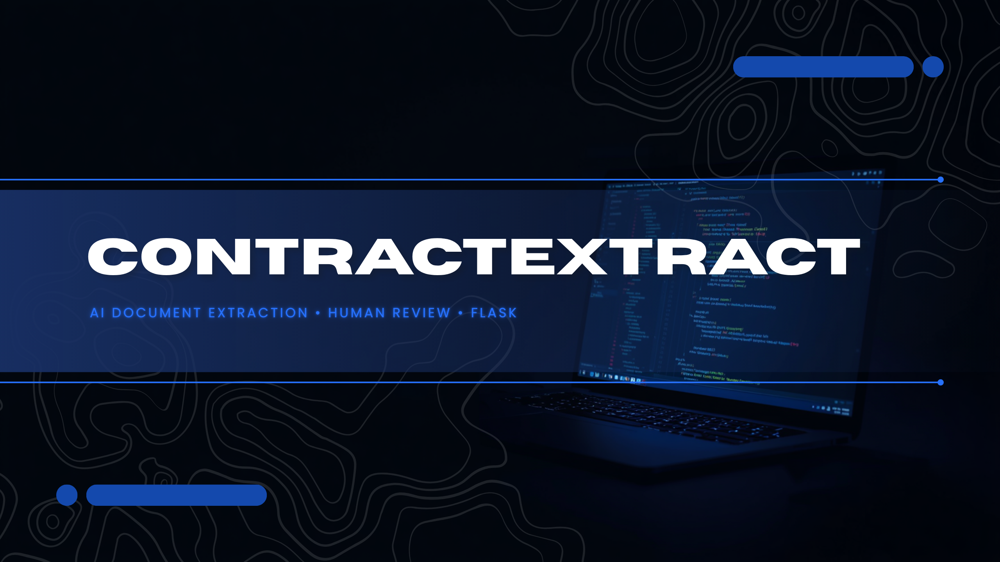
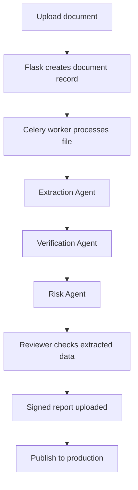

# EDCH Roaming Advisor

<p align="center">
      
</p>

EDCH Roaming Advisor is a Flask-based document processing platform for roaming agreement review. It ingests contract-style files, runs asynchronous extraction and validation in the background, and supports a human review flow before records are published.

The application is built around a practical operator workflow:

1. A user uploads a PDF, DOCX, XLSX, or XLS file.
2. Flask stores the file and creates a document record.
3. Celery processes the document in the background.
4. The extraction pipeline pulls structured agreement data from the file.
5. Verification and risk checks help reviewers assess the result.
6. Signed output can be uploaded and published to production.

<p align="center">
      <b>Upload → background extraction → verification → final review → publish</b>
</p>

---

## Highlights

- Asynchronous document processing with Celery and Redis.
- Flask web UI for upload, dashboard, review, and publishing flows.
- AI-assisted extraction built around Google Gemini and LangChain components.
- Local LM Studio integration for OpenAI-compatible model calls during extraction.
- Structured agreement models for headers, rate tables, and commitments.
- Human review steps for extracted output, signed reports, and final approval.
- Dynamic review templates that scale as agreement header fields expand.
- PostgreSQL persistence with Flask-Migrate support.
- Dockerized local development and deployment.

## How It Works



## Tech Stack

| Layer | Tools |
|---|---|
| Web | Flask, Jinja2 |
| Background jobs | Celery |
| Queue and cache | Redis |
| Database | PostgreSQL |
| AI / orchestration | Google Gemini, LangChain, LangGraph |
| Local inference | LM Studio via OpenAI-compatible client |
| Data validation | Pydantic |
| File handling | PyMuPDF, python-docx, openpyxl, pandas |
| Deployment | Docker, Docker Compose, Gunicorn |

## Quick Start

### Prerequisites

- Docker Desktop installed and running.
- A Google Gemini API key.
- A populated `.env` file with the runtime settings below.

### 1. Configure the environment

Create a `.env` file in the project root and add at least these values:

- `SECRET_KEY`
- `DATABASE_URL`
- `REDIS_URL`
- `GOOGLE_API_KEY`
- `SUPABASE_URL`
- `SUPABASE_ANON_KEY`
- `UPLOAD_FOLDER`

### 2. Start the stack

```bash
docker compose up --build
```

Open the app at `http://localhost:8000`.

If you want to use the local model integration, start LM Studio on the host machine and make sure its OpenAI-compatible server is available at `http://localhost:1234`.

### 3. Apply database migrations

```bash
docker compose exec web flask db upgrade
```

## Local Development

```bash
python -m venv .venv
.venv\Scripts\activate
pip install -r requirements.txt
flask --app wsgi run --port 8000
```

Run the worker in a second terminal:

```bash
celery -A celery_worker.celery worker --loglevel=info
```

## Project Structure

```text
app/
├── agents/                # Extraction, verification, and risk orchestration
├── blueprints/            # Auth, dashboard, jobs, and update routes
├── models/                # SQLAlchemy models for users, documents, agreements, and logs
├── schemas/               # Pydantic schemas for extracted data
├── services/              # Gemini, baseline, storage, and file adapters
├── static/                # CSS, images, and stored PDFs
├── tasks/                 # Celery jobs
└── templates/             # Dashboard and review views
migrations/                # Alembic migration environment and revisions
uploads/                   # Local upload target
```

## Document Lifecycle

The main document states used by the app are `PENDING`, `PROCESSING`, `READY`, `FAILED`, and `PUBLISHED`.

## Extraction And Mapping

The latest branch work adds a local model client in [app/services/llm_client.py](app/services/llm_client.py) and a database mapping layer in [app/services/db_mapper.py](app/services/db_mapper.py). Together, these pieces convert extracted JSON into staging records, attach confidence scoring, and keep the document linked to the extracted `AGMT_ID`.

The review pages now render agreement headers dynamically so the UI can accommodate additional header fields without a hard-coded form update.

## Testing

```bash
pytest
```

The repository includes unit, integration, end-to-end, and slow test markers in `pytest.ini`.

## Configuration Reference

| Variable | Purpose |
|---|---|
| `SECRET_KEY` | Flask session secret |
| `DATABASE_URL` | PostgreSQL connection string |
| `REDIS_URL` | Redis broker and result backend |
| `GOOGLE_API_KEY` | Gemini API key |
| `SUPABASE_URL` | Supabase project URL used by the dashboard |
| `SUPABASE_ANON_KEY` | Supabase anonymous key used by the dashboard |
| `UPLOAD_FOLDER` | Local upload destination |

## Notes

- Supported uploads are PDF, DOCX, XLSX, and XLS.
- Files are stored under `app/static/pdfs/` for browser-based preview and review.
- The app uses Flask-Migrate, so schema changes should be managed through migrations rather than direct table edits.